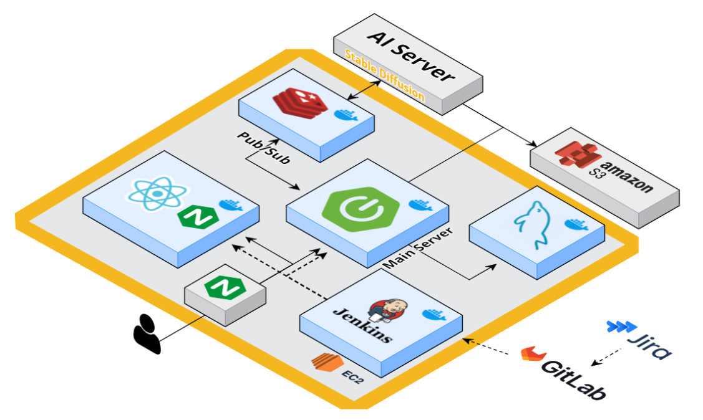

# 💐꽃말로 마음을 전하는 서비스, [꽃마리]
꽃말을 통한 메세지를 전달하세요!

생성형 AI를 활용한 꽃다발 이미지 생성 서비스

## 📌 기획 배경

* 기존의 꽃다발을 선물하기 위해서는
  * 기존의 꽃다발은 꽃의 색과 형태에 주로 집중하였습니다.
  * 이미 만들어져 있는 꽃다발을 사는 경우도 많았습니다.
  * 플로리스트에게 제작을 요청하고 싶어도 참고할 자료가 없었습니다.

* 우리의 서비스는 
  * 사용자가 전달하고 싶은 마음을 꽃말 기반으로 꽃다발을 생성합니다.
  * 생성형 이미지로 제작하여 실제 꽃다발 주문제작에 참고 이미지를 제공합니다.

## 💡 주요 기능

#### 1. 소셜로그인 & 텍스트 입력 

- 카카오 소셜 로그인

- 사용자 입력 텍스트 기반 프롬프트를 통해 GPT 4 API를 사용하여 해당 상황에 어울리는 꽃말을 가진 꽃을 총 3개 추천

#### 2. 이미지 생성

- Stable Diffusion을 사용하여 학습시킨 꽃다발 이미지 생성 모델을 사용하여 AI 서버에서 이미지 생성

- Noise에서부터 생성되는 중간 이미지를 SSE 통신을 통해 지속적으로 전송

#### 3. 추천 및 직접 꽃 선택하여 재생성 & 이미지 다운로드

- GPT API를 통해 선택된 꽃들과 이로 생성된 꽃다발 이미지 전송

- 1개의 꽃다발에 최대 3종류의 꽃이 사용될 수 있음
- 동시에 꽃다발 생성에 사용된 꽃을 대신할 꽃들도 추가적으로 추천
- 사용자는 이를 선택하거나 직접 전체 꽃을 조회하여 원하는 꽃으로 바꾸어 꽃다발을 재생성할 수 있음
- 꽃다발 생성에 사용된 꽃 당 3개씩 추가로 추천해주며, 추천 기준은 GPT 추천, 동일 색, 인기도
- 꽃다발이 완성되면 이미지를 다운로드 받을 수 있음

#### 4. 다른 사용자 이미지 검색 및 다운로드 & 지도 API

- 다른 사용자들이 만든 꽃다발 이미지들을 보고 다운로드 받을 수 있음
- 다운로드된 꽃다발에 사용된 꽃들의 인기도 반영

- 카카오 맵 API를 활용하여 현재 내 위치를 기준으로 주변 꽃집 정보 제공

## ⏰ 개발 기간
2024.02.26 ~ 2024.4.04 (6주)

## 👩 팀 구성

| [윤길재](https://github.com/747Socker)                                                    | [이혜지](https://github.com/rheeeuro)                                                     | [우창진](https://github.com/JHyeon-a)                                                                                          | [박민아](https://github.com/heeyeon3050)                                                   | [정덕주](https://github.com/Damongsanga)                                                   | [한태희](https://github.com/nyanpasu-life)                                                      |
| ----------------------------------------------------------------------------------------- | ----------------------------------------------------------------------------------------- | ------------------------------------------------------------------------------------------------------------------------------ | ------------------------------------------------------------------------------------------ | ------------------------------------------------------------------------------------------ | ----------------------------------------------------------------------------------------- |
|  |  |  |  |  |  |
| Leader, Frontend                                                                             | Frontend                                                                               | Backend                                                                                                                          | Backend                                                                                       | CI&CD, Backend                                                                                       | AI                                                                               |
| SSE 통신 api 꽃다발 리스트                                                     | 전체 페이지 레이아웃 구현                                     | Redis 캐싱 & pub/sub  활용한 비동기 통신 SSE 통신 꽃다발 생성 API                           | 디자인 꽃다발 삭제 다운로드 API                         | 인프라 구축 CI/CD 인증/인가 꽃다발 검색 API                                                | 이미지 크롤링 & 정제  Stable Diffusion 학습 AI 서버 작성& 배포 인프라 구축                                                                   |
 

## 🛠️ 기술 스택

### Front
![typescript][typescript]  ![React][React] ![HTML5][HTML5] ![CSS3][CSS3] 

### Back
![Java][Java] ![springboot][springboot] ![springdatajpa][springdatajpa] ![querydsl][querydsl] ![springsecurity][springsecurity] ![oauth][oauth]

### Cooperation
![gitlab][gitlab] ![Jira][Jira] ![mattermost][mattermost] ![discord][discord] ![figma][figma] ![notion][notion]

### AI
 ![Python][Python] ![openai][openai] ![stablediffusion][stablediffusion]

### Infrastructure
![amazonec2][amazonec2] ![nginx][nginx]  ![docker][docker] ![jenkins][jenkins]  ![mysql][mysql] ![redis][redis] ![Sonarqube][sonarqube] ![amazons3][amazons3]

## 🎨 아키텍처

## 🌐 Version Info & Setting

[메뉴얼 바로가기](./exec/Flowermari_porting_manual.md)

[openai]: https://img.shields.io/badge/openai--222222?style=for-the-badge&logo=openai&logoColor=222222
[stablediffusion]: https://img.shields.io/badge/stable_diffusion--412991?style=for-the-badge
[Java]: https://img.shields.io/badge/Java--FC6D26?style=for-the-badge&logo=java&logoColor=white
[JavaScript]: https://img.shields.io/badge/JavaScript--F7DF1E?style=for-the-badge&logo=JavaScript&logoColor=white
[CSS3]: https://img.shields.io/badge/CSS3--1572B6?style=for-the-badge&logo=CSS3&logoColor=1572B6
[HTML5]: https://img.shields.io/badge/HTML5--E34F26?style=for-the-badge&logo=HTML5&logoColor=E34F26
[Python]: https://img.shields.io/badge/Python--3776AB?style=for-the-badge&logo=python&logoColor=3776AB
[git]: https://img.shields.io/badge/git--F05032?style=for-the-badge&logo=git&logoColor=white
[gitlab]: https://img.shields.io/badge/gitlab--FC6D26?style=for-the-badge&logo=gitlab&logoColor=FC6D26
[Jira]: https://img.shields.io/badge/Jira--0052CC?style=for-the-badge&logo=jirasoftware&logoColor=0052CC
[mattermost]: https://img.shields.io/badge/mattermost--0058CC?style=for-the-badge&logo=mattermost&logoColor=0058CC
[discord]: https://img.shields.io/badge/discord--5865F2?style=for-the-badge&logo=discord&logoColor=5865F2
[figma]: https://img.shields.io/badge/figma--F24E1E?style=for-the-badge&logo=figma&logoColor=F24E1E
[notion]: https://img.shields.io/badge/notion--000000?style=for-the-badge&logo=notion&logoColor=000000
[intellij]: https://img.shields.io/badge/intellij--000000?style=for-the-badge&logo=intellijidea&logoColor=white
[vscode]: https://img.shields.io/badge/vscode--007ACC?style=for-the-badge&logo=visualstudiocode&logoColor=white
[workbench]: https://img.shields.io/badge/workbench--4479A1?style=for-the-badge&logo=mysql&logoColor=white
[springboot]: https://img.shields.io/badge/springboot-v3.2.3-6DB33F?style=for-the-badge&logo=springboot&logoColor=6DB33F
[Vue.js]: https://img.shields.io/badge/Vue.js-v3.4.15-35495E?style=for-the-badge&logo=vuedotjs&logoColor=4FC08D
[React]: https://img.shields.io/badge/React-v18.2.0-61DAFB?style=for-the-badge&logo=react&logoColor=61DAFB
[Sonarqube]: https://img.shields.io/badge/sonarqube-v4.2.0.3129-4E9BCD?style=for-the-badge&logo=sonarqube&logoColor=4E9BCD
[fastapi]: https://img.shields.io/badge/fastAPI-v0.109.0-009688?style=for-the-badge&logo=fastapi&logoColor=4FC08D
[amazonec2]: https://img.shields.io/badge/amazon_ec2-Ubuntu_20.04-FF9900?style=for-the-badge&logo=amazonec2&logoColor=FF9900
[nginx]: https://img.shields.io/badge/nginx-v1.18.0-009639?style=for-the-badge&logo=nginx&logoColor=4FC08D
[redis]: https://img.shields.io/badge/redis-v7.2.4-DC382D?style=for-the-badge&logo=redis&logoColor=DC382D
[mysql]: https://img.shields.io/badge/mysql-v8.0.36-4479A1?style=for-the-badge&logo=mysql&logoColor=4479A1
[docker]: https://img.shields.io/badge/docker-v25.0.4-2496ED?style=for-the-badge&logo=docker&logoColor=2496ED
[jenkins]: https://img.shields.io/badge/jenkins-v2.441-D24939?style=for-the-badge&logo=jenkins&logoColor=D24939
[amazons3]: https://img.shields.io/badge/amazons3--569A31?style=for-the-badge&logo=amazons3&logoColor=569A31
[typescript]: https://img.shields.io/badge/typescript--3178C6?style=for-the-badge&logo=typescript&logoColor=3178C6
[springdatajpa]: https://img.shields.io/badge/SPRINGDATAJPA--6DB33F?style=for-the-badge&logoColor=white
[querydsl]: https://img.shields.io/badge/querydsl-v5.0.0-669DF6?style=for-the-badge&logoColor=white
[springsecurity]: https://img.shields.io/badge/SPRINGSECURITY--6DB33F?style=for-the-badge&logo=springsecurity&logoColor=6DB33F
[oauth]: https://img.shields.io/badge/OAUTH--2F2F2F?style=for-the-badge&logo=OAUTH&logoColor=white
